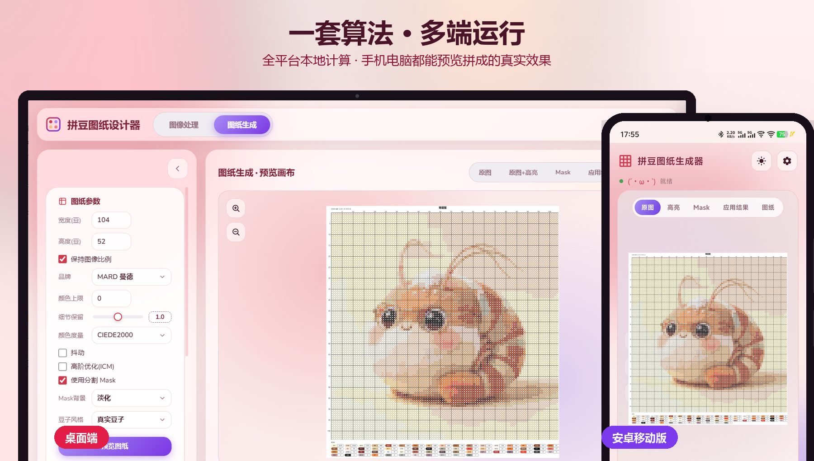
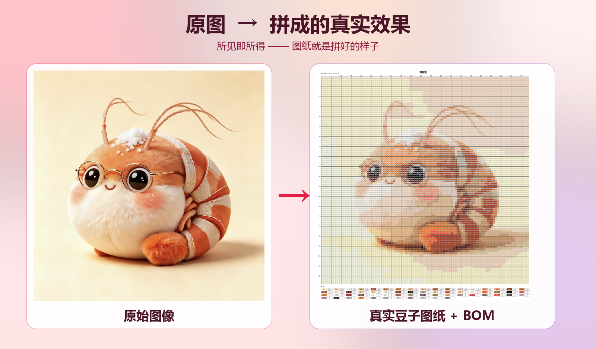
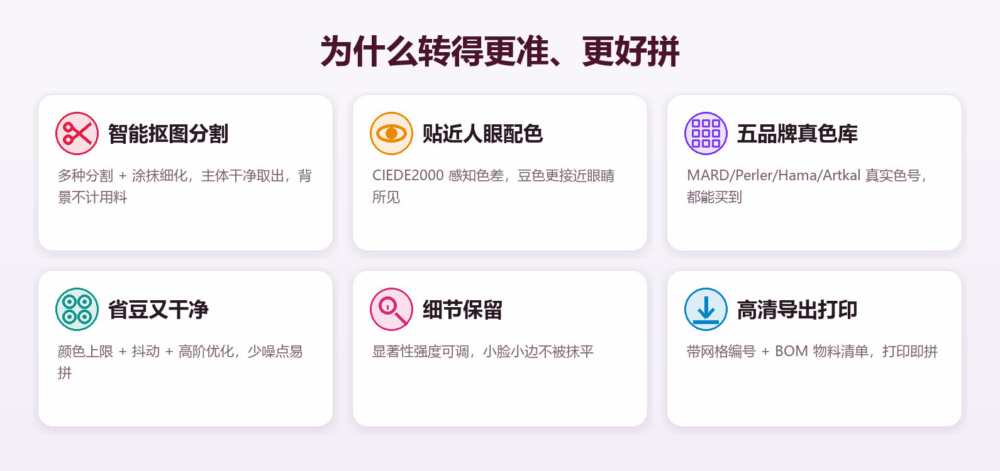

# 拼豆图纸设计器

**把任意图像，一键变成可拼的拼豆图纸**

全平台本地计算 · 无需联网 · 隐私不出机

---

## 一套算法 · 多端运行

桌面（Windows / macOS / Linux）+ 安卓移动版，**同一套转换算法**，在任何一台设备上都能得到一致、精准的图纸。所有计算都在**本地**完成 —— 不联网、不上传，你的照片始终留在自己设备里。

---

## 效果一览

从一张照片到一张可直接对照拼的真实豆子图纸 —— **所见即所得，图纸就是拼好的样子**。附带完整物料清单（BOM）。**真实豆子风格**用同心圆环 + 中央孔洞（透出底板色）还原实物拼豆插在底板上的穿孔质感，色号与数量统一放在图纸主体之外的 BOM 区，干净易读。

---

## 工作流程（五步）

1. **加载图像** —— 点「加载图像」，或直接把图片拖进画布。
2. **预处理（可选）** —— 调亮度 / 对比度 / 高斯模糊，或框选裁剪。
3. **前景分割（可选）** —— 框选 + 分割，涂抹细化，只保留想要的前景。
4. **生成图纸** —— 设宽度 / 颜色上限 / 品牌 / 豆子风格，点「预览图纸」查看效果与 BOM。
5. **导出** —— 填文件名、选输出路径，点「导出图纸」得到高清 PNG。

> 更详细的操作说明与技巧，见应用内「设置 → 关于 → 查看使用指南」。

---

## 为什么转得更准、更好拼

不靠运气，靠一套针对「把照片变成拼豆」这件事打磨的转换管线 —— 在不泄露实现细节的前提下，它为你做了这几件事：

- **智能抠图分割**：多种前景分割策略 + 涂抹细化，把主体干净地从背景里取出来，背景不计入用料。
- **贴近人眼的配色**：多种感知色差度量（默认 CIEDE2000），让选出的豆色更接近你眼睛看到的样子，而不是机械的数字距离。
- **五品牌真实色库**：内置 **5 大拼豆品牌**的真实色号库，图纸上的每个色号都能买到对应的豆子。
- **省豆又干净**：颜色上限控制 + 抖动过渡 + 高阶优化，把任意照片收敛成**省豆、易拼、少噪点**的图纸。
- **细节保留**：显著性细节保留强度可调，小脸、小边缘不被量化抹平。
- **高清导出打印**：带网格编号与 BOM 物料清单的高清图纸，打印出来就能对照拼。

最终效果：**照片进，图纸出** —— 颜色准、噪点少、用料清单清晰，照着 BOM 就能拼。

---

## 功能特性

- **图像加载与预处理**
  - 加载 JPG、PNG、BMP 等常见格式
  - 缩放、亮度 / 对比度、高斯模糊
  - 框选裁剪（裁剪结果可作为新「原图」继续处理）

- **前景分割与抠图**
  - 多种分割方法：GrabCut 矩形、分水岭、Otsu、SLIC
  - 前景 / 背景涂抹细化、形态学操作（开 / 闭运算）
  - 仅用 Mask 前景生成图纸，背景不计入 BOM

- **图纸生成**
  - 自定义图纸宽度 / 高度（豆数），保持图像比例
  - 颜色数量上限、细节保留强度
  - **5 品牌颜色库**：MARD 曼德(221) / Perler / Hama / Artkal S-5mm / Artkal C-2.6mm
  - 多种色差算法（CIEDE2000 默认 / CIE76 / Lab / 欧氏 / 加权）
  - 抖动、高阶优化(ICM) 减少噪点与色偏
  - **豆子风格**：真实豆子（同心圆环 + 中央孔洞，默认）/ 经典方格（每格印色号），可一键切换
  - 图纸标题、物料清单 BOM（色号 / 名称 / 数量 / 百分比）

- **导出 PNG**
  - 按图纸尺寸导出高清图，自定义缩放倍数

- **自定义主题**
  - 导入任意图片作半透明背景，自动提取主体颜色适配整套主题色
  - 背景不透明度、背景模糊（无 / 中 / 高 三档）可调
  - 主题：跟随系统 / 浅色 / 深色

- **设置中心**
  - 图纸 / 分割默认参数持久化，重开自动带出

- **在线更新**
  - 设置页一键检查新版本
  - 桌面端：下载后提示重启，自动覆盖安装并重启
  - 安卓端：下载 APK 后调系统安装器安装

---

## 下载与安装（普通用户）

无需安装 Python，直接从 [Releases](https://github.com/RecardoLyu/PerlerBeadsDesigner/releases) 下载对应平台：

| 平台 | 文件 | 说明 |
|---|---|---|
| Windows | `PerlerBeadsDesigner-windows-vX.Y.Z.zip` | 解压后双击 `PerlerBeadsDesigner.exe` 运行 |
| macOS | `PerlerBeadsDesigner-macos-vX.Y.Z.tar.gz` | 解压运行 |
| Linux | `PerlerBeadsDesigner-linux-vX.Y.Z.tar.gz` | 解压运行 |
| 安卓 | `PerlerBeadsDesigner-android-vX.Y.Z.apk` | 直接安装（debug 版） |

> 想从源码运行 / 二次开发，见下方「开发文档」。

---

## 参数说明

- **宽度 / 高度(豆)**：图纸尺寸（单位：拼豆数）
- **颜色上限**：0 = 不限制；> 0 = 最多用 N 种颜色（越少越省豆、越易拼）
- **细节保留**：值越大越能保住图像小细节与边缘
- **颜色度量**：拟合豆色的色差算法，CIEDE2000 最接近人眼感知（默认）
- **豆子风格**：真实豆子（同心圆环 + 中央孔洞，贴近实物）/ 经典方格（每格印色号）
- **抖动**：相邻豆交错模拟过渡色
- **高阶优化(ICM)**：迭代微调减少局部色偏与孤岛噪点
- **PNG 缩放**：导出图的缩放倍数（越大越清晰、文件越大）

---

## 故障排除

- **无法加载图像**：确认格式为 JPG / PNG / BMP，且文件未损坏。
- **分割效果不理想**：换分割方法、调整参数，或先做亮度 / 对比度预处理。
- **图纸颜色偏差大**：换色差算法（推荐 CIEDE2000）、提高颜色上限、开抖动。
- **导出失败**：确认输出目录有写入权限、磁盘空间充足。

---

## 颜色库

内置 5 个品牌的真实拼豆颜色库，BOM 色号与品牌严格对应：

- MARD 曼德（221 色，中文名）
- Perler（103 色）
- Hama（92 色）
- Artkal S-5mm（199 色）
- Artkal C-2.6mm（174 色）

---

## 许可证

本项目采用 MIT 许可证，详见 [LICENSE](LICENSE)。

## 联系方式

- Email: lvyh24@mails.tsinghua.edu.cn
- GitHub: https://github.com/RecardoLyu

## 致谢

- 感谢 [Pixel Beads](https://www.pixel-beads.com) 提供真实的拼豆颜色库
- 使用 OpenCV、FastAPI、pywebview、Flutter 等开源项目

## 开发文档

面向开发者（架构、源码运行、打包、贡献）：

- [DEVELOPMENT.md](DEVELOPMENT.md) — 项目架构、项目结构、核心模块、调试
- [DEPLOYMENT.md](DEPLOYMENT.md) — 打包为可执行文件、发布版本
- [CONTRIBUTING.md](CONTRIBUTING.md) — 分支工作流与贡献指南

---

<b>版本</b> 2.4.1 · <b>最后更新</b> 2026 年 8 月

